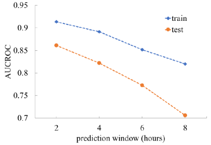
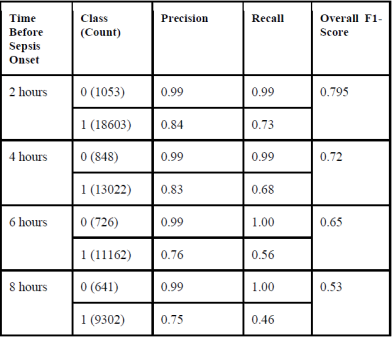
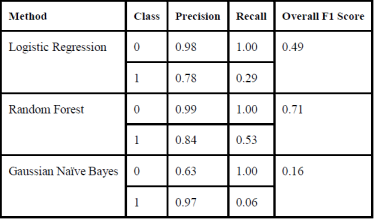

<h2>Google Summer of Code - CBMI-UTHSC</h2>

<h3>Early Sepsis Prediction using Machine Learning</h3>

<h3>Collaborators - Ronet Swaminathan, Aditya Singh, Akram Mohammed and Rishikesan Kamaleswaran</h3>

<h3>Table of Contents</h3>
<ol>
    <li>Introduction</li>
    <li>Modules</li>
    <li>Code Description</li>
    <li>GSoC Experience</li>
    <li>Conclusion</li>
</ol>

<h3>Introduction</h3>

This project aims to provide improved solution to the medical world, where millions of people die due to to Sepsis, a fatal disease where the patient has sustained and dyregulated response to infection. Since sepsis is time-sensitive, it quickly escalates to multiorgan failures, that greatly increases the risk of death. Here we try to accurately predict the occurence of sepsis hours before it actaully occurs. This will provide doctors to take contingency actions early, and will decrease mortality rates significantly. 

This project is based off the <b>eICU</b> database, managed by <b>physionet</b>. Critically ill patients are admitted to the ICU where they receive complex and time-sensitive care from a wide array of clinical staff. Electronic measuring devices are attached to them that produce data at regular intervals. This data, from multiple hospitals was assimilated into the eICU database. 
The vitals for the patients were measured every 5 minutes. Such a frequency is ideal because reduced frequency does not allow us to get a deep insght into the patient's condition, and consequentially, the models are not accurate enough. 

In this project, we apply multiple machine learning methods to generate descriptive features that are clinically meaningful and predict the onset of sepsis.

<i><b>NOTE: For the database features, please go through the documentation of the eICU database here: https://eicu-crd.mit.edu/about/eicu/</b></i>

<h3>Modules</h3>

<ol>
<li><h4>Extracting relevant data</h4></li>
Since there are multiple tables to work with and the SOFA needs to be calculated from multiple sources, we converged all the relevant things to a single table. For reference, the following is the break-up (for debugging purposes): 

<ul>
    <li><b><i>lab.csv</i></b> was used to extract the lab values.</li>
    <li><b><i>nurseCharting.csv</i></b> was used to extract the GCS scores as well as the MAP and ventilator details.</li>
    <li><b><i>infusionDrug.csv</b></i> was used to extract all relevant vasopressors like Norepinephrine, Dopamine etc. </li>
    <li><b><i>vitalPeriodic.csv</i></b> was were all the vitals for the patients were recorded in a frequency of 5 minutes. </li>
    <li>The IV antibiotics data has been collected from the <b><i>medication.csv</i></b> table for each registered patient, while the fluid samples data was taken from the <b><i>microlab.csv</i></b></li>
    <li>Apart from the essential parameters needed for SOFA score calculation, we have also included a number of different variables to the final training data to check how they influence the model as will be shown in the feature importance curve. Some of them are:
    <ul>
    <li>calcium</li>
    <li>glucose</li>
    <li>lactate</li>
    <li>magnesium</li>
    <li>Phosphate</li>
    <li>potassium</li>
    </ul>
    </li>
</ul>

<li><h4>SOFA Calulations</h4></li>
For the SOFA calulation, we first merged all the aforementioned extracted tables. Then we followed the given rubrics to calculated the SOFA-3 scores.

Here is a small code snippet of one of the parts of SOFA calculation:

<pre>
    labs_withO2.loc[(labs_withO2['platelets_x_1000'] >=150), 'SOFA_Coagulation'] = 0
    labs_withO2.loc[(labs_withO2['platelets_x_1000'] <150), 'SOFA_Coagulation'] = 1
    labs_withO2.loc[(labs_withO2['platelets_x_1000'] <100) , 'SOFA_Coagulation'] = 2
    labs_withO2.loc[(labs_withO2['platelets_x_1000'] <50), 'SOFA_Coagulation'] = 3
    labs_withO2.loc[(labs_withO2['platelets_x_1000'] <20), 'SOFA_Coagulation'] = 4

    labs_withO2.loc[(labs_withO2['total_bilirubin'] <1.2), 'SOFA_Liver'] = 0
    labs_withO2.loc[(labs_withO2['total_bilirubin'] >=1.2) & (labs_withO2['total_bilirubin'] <=1.9), 'SOFA_Liver'] = 1
    labs_withO2.loc[(labs_withO2['total_bilirubin'] >=2) & (labs_withO2['total_bilirubin'] <=5.9), 'SOFA_Liver'] = 2
    labs_withO2.loc[(labs_withO2['total_bilirubin'] >=6) & (labs_withO2['total_bilirubin'] <=11.9), 'SOFA_Liver'] = 3
    labs_withO2.loc[(labs_withO2['total_bilirubin'] >12), 'SOFA_Liver'] = 4

    labs_withO2.loc[(labs_withO2['paO2_FiO2'] >=400), 'SOFA_Respiration'] = 0
    labs_withO2.loc[(labs_withO2['paO2_FiO2'] <400), 'SOFA_Respiration'] = 1
    labs_withO2.loc[(labs_withO2['paO2_FiO2'] <300), 'SOFA_Respiration'] = 2
    labs_withO2.loc[((labs_withO2['paO2_FiO2'] <200) & (labs_withO2['nursingchartvalue'] =='ventilator')), 'SOFA_Respiration'] = 3
    labs_withO2.loc[((labs_withO2['paO2_FiO2'] <100) & (labs_withO2['nursingchartvalue'] =='ventilator')), 'SOFA_Respiration'] = 4

    labs_withO2.loc[((labs_withO2['creatinine'] >=0) & (labs_withO2['creatinine'] <=1.1)), 'SOFA_Renal'] = 0
    labs_withO2.loc[((labs_withO2['creatinine'] >=1.2) & (labs_withO2['creatinine'] <=1.9)), 'SOFA_Renal'] = 1
    labs_withO2.loc[((labs_withO2['creatinine'] >=2) & (labs_withO2['creatinine'] <=3.4)), 'SOFA_Renal'] = 2
    labs_withO2.loc[((labs_withO2['creatinine'] >=3.5) & (labs_withO2['creatinine'] <=4.9)) | (labs_withO2['urinary_creatinine'] <200), 'SOFA_Renal'] = 3
    labs_withO2.loc[(labs_withO2['creatinine'] >5) | (labs_withO2['urinary_creatinine'] <200), 'SOFA_Renal'] = 4
</pre>

<li><h4>Feature Extraction</h4></li>
For the feature extraction process, we need to introduce the concept of time windows and time before true onset. Preprocessing is done is such a way that the time window, i.e the amount of data in a time period required to train the model is kept constant at 6 hours. So, we always train the model using 6hrs worth of data. Time before true onset means how early do we want to predict sepsis. This parameter has been varied in steps of 2 hours to get a better understanding of how your accuracy drops off as the time difference increases. For this experiment, we have used time priors of 2, 4, 6 and 8 hours. 
Then we have preprocessed the entire dataframe according to each of these time differences. So we have processed data for 2 hours before sepsis with 6 hours of training data, 4 hours before with 6 hours of training data and so on so forth.
After the SOFA calculations are done and our final training table is made with multiple clinical and vital variables, the total number of features are 27. We then extracted 7 statistical features from each of the original 27 features.  
They are:
<ul>
<li>Standard Deviation</li>
<li>Kurtosis</li>
<li>Skewness</li>
<li>Mean </li>
<li>Minimum</li>
<li>Maximum</li>
<li>RMS_Difference</li>
</ul>
Therefore the net features extracted are 189.

<li><h4>Model Development (XGBoost and others)</h4></li>
XGBoost machine learning method is an efficient and optimized distributed gradient boosting library and provides a parallel tree boosting that solve many data science problems in a fast and accurate way.The data is first partitioned into the train (80%) and test (20%) datasets. The train set is used for cross-validated models, while the test set was used to perform the model validation.

Five-fold cross-validation model was developed using XGBClassifier. The area under the ROC curve (AUROC) is a function of prediction window. The AUROC for the training set was higher than the testing set. The average testing AUROC at 2 hours prior to the sepsis onset was 0.86. However, the AUROC decreases as we move away from the time of sepsis onset. 

The average testing cross-validated recall and precision for predicting sepsis class are 73%, and 84%, respectively, 2 hours before the sepsis onset. Whereas, the overall F1-Score was 79.5%. The following provides the precision, recall and F1 score for each of the time intervals before the sepsis onset. 

Here we compare the XGBoost F1-Score with the other machine learning methods (RF: Random Forest; LR: Logistic Regression; GNB: Gaussian Naïve Bayes).

<b><i>NOTE: All of the model statistics are exclusive to the eICU database. A new database might produce different results, better or worse. Hyper-parameterization will be required.</i></b>

</ol>
<h3>Code Description</h3>
<b><i>NOTE: Before using any of the functions listed in this project, make sure the data is formatted according the eICU schema. Only then, will it work as intended.</i></b>
<ul>
<li><b>antibiotics.py</b></li>
<li><b>gcs_extract.py</b></li>
<li><b>labs_extract.py</b></li>
<li><b>merge_final_table.py</b></li>
<li><b>sepsis_calc.py</b></li>
<li><b>vasopressor_extract.py</b></li>
</ul>
<h3>GSoC Experience</h3>
Google Summer of Code gave me a worthy platform to burnish my skills as well as learn new ones. I had never worked with data at such a large scale. As expected, I faced my fair share of difficulties. Firstly, I had a very hard time running all the preprocessing code on my local machine. There was some wastage of time there. But, upon getting access to the UTHSC supercomputer, things started progressing at a much faster pace. I still faced some trouble optimizing all the code. That way, I learnt a lot of vectorization (something I had only implemented in some lab exercises). Also, the relevant data was very scattered throughout the eICU database. Assimilating everything was time consuming, yet the final rsult was even more rewarding. I also had to resolve data insufficiency issues. 
But my mentors were supportive of all that I did. They constantly provided me with constructive criticism, that helped me shape up my project.  
Also, GSoC gave me an opportunity to collaborate with international domain experts. Data Science in the healthcare industry has massive amounts of untapped potential and I'm happy that I was able to contribute effectively to their research on Sepsis through this project. 
As an added bonus, me and my mentors were able to create a research paper on this project. This paper, at the time of writing this readme is under review. The paper has been submitted to the IEEE EMB HIPOCT 2019 conference. (Status will be updated)

<h3>Conclusion</h3>
This project was one of the biggest milestones in my undergrad timeline. I wish to continue contributing to open-source organization like CBMI-UTHSC in the future as well. This project has given me a new field (i.e. Computational Biology), to ponder upon. This project has also helped me shape up my future plans for a Masters degree.
